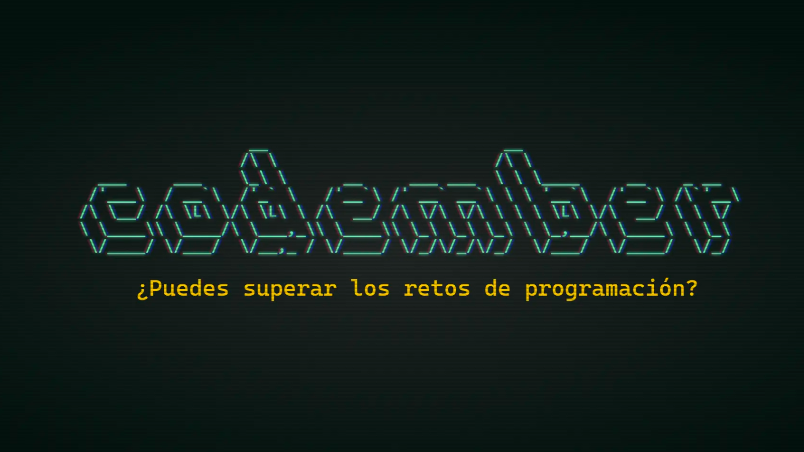

# CODEMBER 2023

# [Codember](https://codember.dev)

Problem-solving and clues to the secrets and challenges I encountered from the game [codember](https://codember.dev) by [@midudev](https://github.com/midudev/).

## Challenges

| Challenge | Name                          |                                    |
|:---------:|:------------------------------|:----------------------------------:|
|    #01    | 🕵️ Spy encrypted messages    | [solution](./Challenge_01/main.py) |
|    #02    | 🧮 Mini compiler              | [solution](./Challenge_02/main.py) | 
|    #03    | 🪪 The Spy Encryption         | [solution](./Challenge_03/main.py) | 
|    #04    | 📂 Hackers damage file system | [solution](./Challenge_04/main.py) |
|    #05    | 🔚 Final problem              | [solution](./Challenge_05/main.py) |  

## Secrets

| Secret | Name                                |
|:------:|:------------------------------------|
|  #01   | 🕹️ K️onami code                    |
|  #02   | 📸 Blurred picture                  |
|  #03   | 🗓️ You have a new mail             |
|  #04   | 🎉 Confetti                         |
|  #05   | 🧙‍♂️ Itsmagic                      | 
|  #06   | 🧑‍💻 You have a new mail II        |
|  #07   | 🛢️ Barrel roll                     |
|  #08   | 👩‍🚀 Private folder log            |
|  #09   | 🎞️ Private folder photo            |
|  #10   | 🪐 Private folder final log         |
|  #11   | 🐄 You have a new mail III (cowsay) |
|  #12   | 🐞 You have a new mail IV (bugs)    |
|  #13   | 🎲 Play tetris                      |